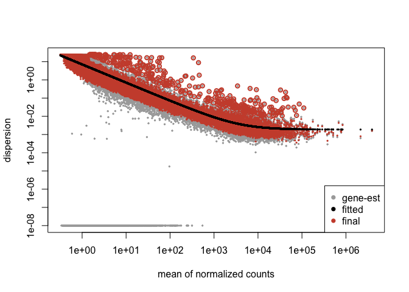
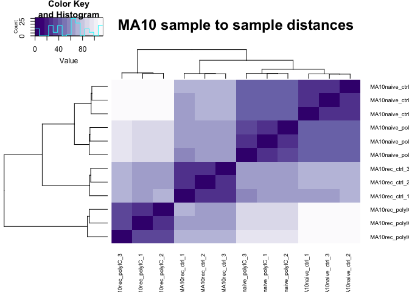
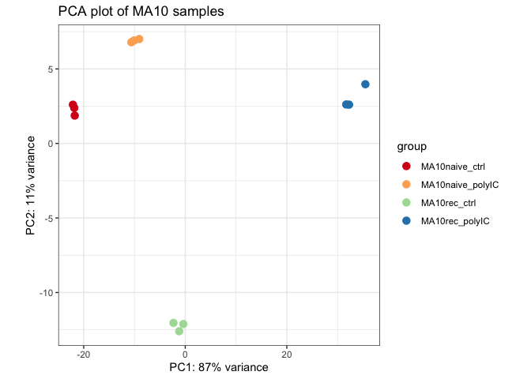

XR090_DESeq2_MA10
================
Alexander Lercher
2025-06-19

## R Markdown

This script uses DESeq2 to analyze bulk RNA-seq data from alveolar
macrophages isolated from naive mice or mice recovered from SARS-CoV-2
strain MA10 infection following restimulation with the viral PAMP polyIC
ex vivo.

``` r
#--------------------------------------------------------------------
# LOAD PACKAGES
#--------------------------------------------------------------------
library(tidyr)
library(dplyr)
```

    ## 
    ## Attaching package: 'dplyr'

    ## The following objects are masked from 'package:stats':
    ## 
    ##     filter, lag

    ## The following objects are masked from 'package:base':
    ## 
    ##     intersect, setdiff, setequal, union

``` r
library(readr)
library(stringr)
library(ggplot2)
library(gplots)
```

    ## 
    ## Attaching package: 'gplots'

    ## The following object is masked from 'package:stats':
    ## 
    ##     lowess

``` r
library(RColorBrewer)
library(DESeq2)
```

    ## Loading required package: S4Vectors

    ## Loading required package: stats4

    ## Loading required package: BiocGenerics

    ## Loading required package: generics

    ## 
    ## Attaching package: 'generics'

    ## The following object is masked from 'package:dplyr':
    ## 
    ##     explain

    ## The following objects are masked from 'package:base':
    ## 
    ##     as.difftime, as.factor, as.ordered, intersect, is.element, setdiff,
    ##     setequal, union

    ## 
    ## Attaching package: 'BiocGenerics'

    ## The following object is masked from 'package:dplyr':
    ## 
    ##     combine

    ## The following objects are masked from 'package:stats':
    ## 
    ##     IQR, mad, sd, var, xtabs

    ## The following objects are masked from 'package:base':
    ## 
    ##     anyDuplicated, aperm, append, as.data.frame, basename, cbind,
    ##     colnames, dirname, do.call, duplicated, eval, evalq, Filter, Find,
    ##     get, grep, grepl, is.unsorted, lapply, Map, mapply, match, mget,
    ##     order, paste, pmax, pmax.int, pmin, pmin.int, Position, rank,
    ##     rbind, Reduce, rownames, sapply, saveRDS, table, tapply, unique,
    ##     unsplit, which.max, which.min

    ## 
    ## Attaching package: 'S4Vectors'

    ## The following object is masked from 'package:gplots':
    ## 
    ##     space

    ## The following objects are masked from 'package:dplyr':
    ## 
    ##     first, rename

    ## The following object is masked from 'package:tidyr':
    ## 
    ##     expand

    ## The following object is masked from 'package:utils':
    ## 
    ##     findMatches

    ## The following objects are masked from 'package:base':
    ## 
    ##     expand.grid, I, unname

    ## Loading required package: IRanges

    ## 
    ## Attaching package: 'IRanges'

    ## The following objects are masked from 'package:dplyr':
    ## 
    ##     collapse, desc, slice

    ## Loading required package: GenomicRanges

    ## Loading required package: GenomeInfoDb

    ## Loading required package: SummarizedExperiment

    ## Loading required package: MatrixGenerics

    ## Loading required package: matrixStats

    ## 
    ## Attaching package: 'matrixStats'

    ## The following object is masked from 'package:dplyr':
    ## 
    ##     count

    ## 
    ## Attaching package: 'MatrixGenerics'

    ## The following objects are masked from 'package:matrixStats':
    ## 
    ##     colAlls, colAnyNAs, colAnys, colAvgsPerRowSet, colCollapse,
    ##     colCounts, colCummaxs, colCummins, colCumprods, colCumsums,
    ##     colDiffs, colIQRDiffs, colIQRs, colLogSumExps, colMadDiffs,
    ##     colMads, colMaxs, colMeans2, colMedians, colMins, colOrderStats,
    ##     colProds, colQuantiles, colRanges, colRanks, colSdDiffs, colSds,
    ##     colSums2, colTabulates, colVarDiffs, colVars, colWeightedMads,
    ##     colWeightedMeans, colWeightedMedians, colWeightedSds,
    ##     colWeightedVars, rowAlls, rowAnyNAs, rowAnys, rowAvgsPerColSet,
    ##     rowCollapse, rowCounts, rowCummaxs, rowCummins, rowCumprods,
    ##     rowCumsums, rowDiffs, rowIQRDiffs, rowIQRs, rowLogSumExps,
    ##     rowMadDiffs, rowMads, rowMaxs, rowMeans2, rowMedians, rowMins,
    ##     rowOrderStats, rowProds, rowQuantiles, rowRanges, rowRanks,
    ##     rowSdDiffs, rowSds, rowSums2, rowTabulates, rowVarDiffs, rowVars,
    ##     rowWeightedMads, rowWeightedMeans, rowWeightedMedians,
    ##     rowWeightedSds, rowWeightedVars

    ## Loading required package: Biobase

    ## Welcome to Bioconductor
    ## 
    ##     Vignettes contain introductory material; view with
    ##     'browseVignettes()'. To cite Bioconductor, see
    ##     'citation("Biobase")', and for packages 'citation("pkgname")'.

    ## 
    ## Attaching package: 'Biobase'

    ## The following object is masked from 'package:MatrixGenerics':
    ## 
    ##     rowMedians

    ## The following objects are masked from 'package:matrixStats':
    ## 
    ##     anyMissing, rowMedians

``` r
#--------------------------------------------------------------------
# DATA IMPORT AND CLEANUP
#--------------------------------------------------------------------
# import table with reads of all samples
data <- read.delim("input/XR090_all_samples_merged.csv")

# remove read statistics from data file
data_raw <- data[5:length(rownames(data)),]

# make gene names row names and remove gene column
row.names(data_raw) <- data_raw$gene
data_raw$gene <- NULL
rm(data)
```

``` r
#--------------------------------------------------------------------
# IMPORT METADATA AND COMPARISONS OF INTEREST
#--------------------------------------------------------------------
# import table with metadata of all samples
metadata <- read.table("input/metadata.txt", header = T)

# import table with groups you want to compare with
# add column with comparison name
# add column with comparison number
DE_groups <- read.table("input/group_comparisons.txt", header = T)

comparison_name <- list()
comparison_number <- list()
for(i in 1:nrow(DE_groups)){
  x <- paste0(DE_groups[i,1],"_vs_",DE_groups[i,2])
  comparison_name[[i]] <- x
  comparison_number[[i]] <- i
}
DE_groups$Comparison <- comparison_name
DE_groups$ComparisonNumber <- comparison_number
rm(comparison_name, comparison_number)
```

``` r
#--------------------------------------------------------------------
# RUN DESeq2
#--------------------------------------------------------------------
# DESeq analyses and create DESeq object
dds <- DESeqDataSetFromMatrix(countData = as.matrix(data_raw),
                              colData = metadata,
                              design = ~ description)
```

    ## Warning in DESeqDataSet(se, design = design, ignoreRank): some variables in
    ## design formula are characters, converting to factors

``` r
dds <- DESeq(dds)
```

    ## estimating size factors

    ## estimating dispersions

    ## gene-wise dispersion estimates

    ## mean-dispersion relationship

    ## final dispersion estimates

    ## fitting model and testing

``` r
#--------------------------------------------------------------------
# FILTER OUT GENES WITH LESS THAN THRESHOLD COUNT ACROSS ALL CONDITIONS
#--------------------------------------------------------------------
threshold_count <- 10
keep <- rowSums(counts(dds)) >= threshold_count
head(keep)
```

    ## 4933401J01Rik       Gm26206          Xkr4       Gm18956       Gm37180 
    ##         FALSE         FALSE         FALSE         FALSE         FALSE 
    ##       Gm37363 
    ##          TRUE

``` r
dds <- dds[keep,]
rm(threshold_count, keep)
```

``` r
#--------------------------------------------------------------------
# EXAMINE DESeq2 RESULTS
#--------------------------------------------------------------------
# calculated correction factors and dispersion plot
as.data.frame(sizeFactors(dds))
```

    ##                  sizeFactors(dds)
    ## MA10rec_ctrl_1          1.2248887
    ## MA10rec_ctrl_2          1.2298752
    ## MA10rec_ctrl_3          1.0667164
    ## MA10rec_polyIC_1        0.8693623
    ## MA10rec_polyIC_2        0.8321513
    ## MA10rec_polyIC_3        0.8767542
    ## naive_ctrl_1            1.2252079
    ## naive_ctrl_2            1.2811169
    ## naive_ctrl_3            1.2558950
    ## naive_polyIC_1          0.8656299
    ## naive_polyIC_2          0.8896045
    ## naive_polyIC_3          1.0223334
    ## naive_ctrl_1.1          1.0663499
    ## naive_ctrl_2.1          0.9426814
    ## naive_ctrl_3.1          0.7171054
    ## naive_polyIC_1.1        1.3021949
    ## naive_polyIC_2.1        0.9685008
    ## naive_polyIC_3.1        0.9021479
    ## PR8rec_ctrl_1           1.0959819
    ## PR8rec_ctrl_2           0.8782563
    ## PR8rec_ctrl_3           0.8516206
    ## PR8rec_polyIC_1         0.9207371
    ## PR8rec_polyIC_2         0.9812066
    ## PR8rec_polyIC_3         1.1798592

``` r
plotDispEsts(dds,
             genecol = "darkgray",
             fitcol = "black",
             finalcol = "tomato3")
```

<!-- -->

``` r
#--------------------------------------------------------------------
# SAMPLE DISTANCE PLOTS
#--------------------------------------------------------------------
# do sample distance plot for MA10 conditions only
# do sample distance plot for all samples
rld <- rlog(dds)
sampleDist <- dist(t(assay(rld)))
as.matrix(sampleDist)[1:3,1:3]
```

    ##                MA10rec_ctrl_1 MA10rec_ctrl_2 MA10rec_ctrl_3
    ## MA10rec_ctrl_1        0.00000        28.6323       29.73453
    ## MA10rec_ctrl_2       28.63230         0.0000       28.12130
    ## MA10rec_ctrl_3       29.73453        28.1213        0.00000

``` r
sampleDistMatrix <- as.matrix(sampleDist)
rownames(sampleDistMatrix) <- paste(rld$description, rld$replicate, sep="_")
colnames(sampleDistMatrix) <- paste(rld$description, rld$replicate, sep="_")
colors <- colorRampPalette(rev(brewer.pal(9, "Purples")))

# do sample distance plot for MA10 conditions only
sampleDistMatrix_MA10 <- sampleDistMatrix[grepl("MA10", rownames(sampleDistMatrix)),grepl("MA10", colnames(sampleDistMatrix))]
heatmap.2(sampleDistMatrix_MA10, trace = "none", col = colors, cexRow = 0.7, cexCol = 0.7,main = "MA10 sample to sample distances")
```

<!-- -->

``` r
heatmap.2(sampleDistMatrix_MA10, trace = "none", col = colors, cexRow = 0.7, cexCol = 0.7,main = "MA10 sample to sample distances")
```

``` r
#--------------------------------------------------------------------
# PCA PLOTS
#--------------------------------------------------------------------
# do PCA plot for all samples
vsdata <- vst(dds, blind = F)

# do PCA plot for MA10 conditions only
MA10_conditions <- metadata %>%
  dplyr::select(description) %>%
  distinct(description) %>%
  filter(str_detect(description, "MA10"))
MA10_conditions <- as.character(MA10_conditions$description)

vsdata_MA10 <- vsdata[, vsdata$description %in% c(MA10_conditions)]
plotPCA(vsdata_MA10, intgroup = "description") + 
  scale_color_brewer(palette = "Spectral") + 
  theme_bw() + 
  ggtitle(paste0("PCA plot of MA10 samples")) +
  theme(aspect.ratio = 1)
```

    ## using ntop=500 top features by variance

<!-- -->

``` r
#--------------------------------------------------------------------
# GET DESeq2 RESULTS FOR COMPARISONS OF INTEREST
#--------------------------------------------------------------------
# generate function to generate output files for comparisons of interest
deseq_all_comparisons <- function(deseq_data,pval_cutoff) {
  datalist = list()
  
  for (i in 1:nrow(DE_groups)){
    numerator <- DE_groups[[i,1]]
    denominator <- DE_groups[[i,2]]
    
    #Get results from specific contrasts
    results_contrast <- results(deseq_data, contrast = c("description", numerator, denominator))
    results_contrast_wo_na=results_contrast[!is.na(results_contrast$pvalue),]
    results_contrast_wo_na$gene_id=rownames(results_contrast_wo_na)
    results_contrast_sign=results_contrast_wo_na[results_contrast_wo_na$pvalue<=pval_cutoff,]
    results_contrast_sign$comparison=i
    datalist[[i]]=results_contrast_sign
  }
  big_data = do.call(rbind, datalist)
  return(big_data)
}

# generate file with comparisons of interest
pval_cutoff = 1
results <- deseq_all_comparisons(dds,pval_cutoff)

head(results(dds, tidy=TRUE))
```

    ##       row  baseMean log2FoldChange    lfcSE        stat    pvalue padj
    ## 1 Gm37363 0.9262806      2.2849097 4.027681  0.56730155 0.5705093   NA
    ## 2 Gm19938 0.4589690     -3.1793433 5.917959 -0.53723646 0.5911043   NA
    ## 3 Gm37381 0.5587308      1.4458693 5.835483  0.24777200 0.8043108   NA
    ## 4     Rp1 1.2934460     -1.9657754 3.077673 -0.63872126 0.5230043   NA
    ## 5  Gm6101 0.4936607     -2.2175894 5.888296 -0.37660971 0.7064637   NA
    ## 6   Sox17 0.5127609      0.2954995 6.005823  0.04920218 0.9607582   NA

``` r
summary(results)
```

    ## 
    ## out of 299172 with nonzero total read count
    ## adjusted p-value < 0.1
    ## LFC > 0 (up)       : 36174, 12%
    ## LFC < 0 (down)     : 33435, 11%
    ## outliers [1]       : 0, 0%
    ## low counts [2]     : 87489, 29%
    ## (mean count < 2)
    ## [1] see 'cooksCutoff' argument of ?results
    ## [2] see 'independentFiltering' argument of ?results

``` r
# fact check that number of comparisons in DESeq2 output is same as comparisons of interest in input file
length(unique(data.frame(results)$comparison)) == nrow(DE_groups)
```

    ## [1] TRUE

``` r
# generate table with comparison names
mycomparison_names <- DE_groups %>%
  dplyr::select(ComparisonNumber, Comparison) %>%
  dplyr::rename(comparison = ComparisonNumber,
                comparison_name = Comparison) %>%
  print()
```

    ##    comparison comparison_name
    ## 1           1    MA10rec_....
    ## 2           2    MA10naiv....
    ## 3           3    MA10rec_....
    ## 4           4    MA10rec_....
    ## 5           5    PR8rec_p....
    ## 6           6    PR8naive....
    ## 7           7    PR8rec_c....
    ## 8           8    PR8rec_p....
    ## 9           9    MA10naiv....
    ## 10         10    MA10naiv....
    ## 11         11    MA10rec_....
    ## 12         12    MA10rec_....

``` r
#--------------------------------------------------------------------
# WRITE DESeq2 RESULTS TO FILE
#--------------------------------------------------------------------
# filter for genes with p-value cutoff of choice
padj_cutoff = 1
results_cutoff <- subset(results, results$padj <= padj_cutoff)

# save these results as data frame and add information on comparisons
df_results <- data.frame(results_cutoff)
df_results <-  merge(df_results,mycomparison_names, by=c("comparison"))

# save each comparison as separate data frames
comparisons_list <- list()
for(i in 1:length(unique(df_results$comparison))){
  x <- subset(df_results,df_results$comparison == i)
  y <- filter(mycomparison_names, comparison == i)
  y <- y$comparison_name
  x$comparison_name <- NULL
  x$comparison_name <- as.character(y)
  comparisons_list[[paste0(i,"_",y)]] <- x
  rm(x,y)
}

for(i in 1:length(comparisons_list)){
  write_tsv(comparisons_list[[i]], paste0("output/",names(comparisons_list)[[i]],"_DEG.tsv"))
}
```

``` r
#--------------------------------------------------------------------
# GET FPM/CPM, CLEAN UP TABLE AND WRITE TO FILE
#--------------------------------------------------------------------
# get fpm/cpm from dds
data_cpm <- fpm(dds)
data_cpm <- as.data.frame(data_cpm)
data_cpm$gene <- rownames(data_cpm)
data_cpm  <- data_cpm %>%
  dplyr::select(gene, everything())

# import new col names for data
colnames_data <- read.delim("input/col_names_data.tsv")

# check whether old col name order is correct
colnames(data_cpm) == colnames_data$colnames_old
```

    ##  [1] TRUE TRUE TRUE TRUE TRUE TRUE TRUE TRUE TRUE TRUE TRUE TRUE TRUE TRUE TRUE
    ## [16] TRUE TRUE TRUE TRUE TRUE TRUE TRUE TRUE TRUE TRUE

``` r
# rename data with new colnames
colnames(data_cpm) <- colnames_data$colnames_new

# order columns
data_cpm <- data_cpm %>%
  dplyr::select(order(colnames(data_cpm)))

# save cpm to file
write_tsv(data_cpm, "output/XR090_CPM.tsv")
```

``` r
#--------------------------------------------------------------------
# GET FPKM FROM DDS, CLEAN UP TABLE AND WRITE TO FILE
#--------------------------------------------------------------------
# get gene order from dds object
dds_gene_order <- data.frame(SYMBOL = rownames(dds))

# get transcript lengths (actual transcript, not genomic length)
library(TxDb.Mmusculus.UCSC.mm10.knownGene)
```

    ## Loading required package: GenomicFeatures

    ## Loading required package: AnnotationDbi

    ## 
    ## Attaching package: 'AnnotationDbi'

    ## The following object is masked from 'package:dplyr':
    ## 
    ##     select

``` r
transcriptLengths <- transcriptLengths(TxDb.Mmusculus.UCSC.mm10.knownGene)
# rename gene_id column to ENTREZID
transcriptLengths <- transcriptLengths %>%
  dplyr::rename(ENTREZID = gene_id)

# get ENTREZID and SYMBOLS from all genes
library(org.Mm.eg.db)
```

    ## 

``` r
mm <- org.Mm.eg.db
my.geneID <- unique(transcriptLengths$ENTREZID)
gene_list_geneID <- AnnotationDbi::select(mm, 
                                          keys = my.geneID,
                                          columns = c("ENTREZID", "SYMBOL"),
                                          keytype = "ENTREZID")
```

    ## 'select()' returned 1:1 mapping between keys and columns

``` r
# merge all transcript lengths to all genes
transcriptLengths <- left_join(gene_list_geneID, transcriptLengths)
```

    ## Joining with `by = join_by(ENTREZID)`

``` r
# only keep longest transcript in case some genes have multiple transcripts
longestTranscripts <- transcriptLengths %>%
  na.omit() %>%
  group_by(ENTREZID) %>%
  arrange(desc(tx_len)) %>%
  slice_head()

# merge transcript lengths with genes from dds object (order will be kept)
dds_gene_order_length <- left_join(dds_gene_order,longestTranscripts)
```

    ## Joining with `by = join_by(SYMBOL)`

``` r
# check whether order of SYMBOLS of new table is the same as original DDS object
summary(dds_gene_order$SYMBOL == dds_gene_order_length$SYMBOL)
```

    ##    Mode    TRUE 
    ## logical   24932

``` r
# define basepairs vector
basepairs <- as.vector(dds_gene_order_length$tx_len)

# add basepairs vector to DDS object
mcols(dds)$basepairs <- basepairs

# calculate FPKMs and omit NA (genes with no annotated transcript length)
data_fpkm <- fpkm(dds)
data_fpkm <- na.omit(data_fpkm)
data_fpkm <- as.data.frame(data_fpkm)
data_fpkm$gene <- rownames(data_fpkm)
data_fpkm  <- data_fpkm %>%
  dplyr::select(gene, everything())

# import new col names for data
colnames_data <- read.delim("input/col_names_data.tsv")

# check whether old col name order is correct
colnames(data_fpkm) == colnames_data$colnames_old
```

    ##  [1] TRUE TRUE TRUE TRUE TRUE TRUE TRUE TRUE TRUE TRUE TRUE TRUE TRUE TRUE TRUE
    ## [16] TRUE TRUE TRUE TRUE TRUE TRUE TRUE TRUE TRUE TRUE

``` r
# rename data with new colnames
colnames(data_fpkm) <- colnames_data$colnames_new

# order columns
data_fpkm <- data_fpkm %>%
  dplyr::select(order(colnames(data_fpkm)))

# save FPKM to file
write_tsv(data_fpkm, "output/XR090_FPKM.tsv")
```

``` r
# which R packages and versions?
if ("devtools" %in% installed.packages()) devtools::session_info()
```

    ## ─ Session info ───────────────────────────────────────────────────────────────
    ##  setting  value
    ##  version  R version 4.5.0 (2025-04-11)
    ##  os       macOS Sonoma 14.7.3
    ##  system   aarch64, darwin20
    ##  ui       X11
    ##  language (EN)
    ##  collate  en_US.UTF-8
    ##  ctype    en_US.UTF-8
    ##  tz       America/New_York
    ##  date     2025-06-19
    ##  pandoc   3.2 @ /Applications/RStudio.app/Contents/Resources/app/quarto/bin/tools/aarch64/ (via rmarkdown)
    ##  quarto   1.5.57 @ /Applications/RStudio.app/Contents/Resources/app/quarto/bin/quarto
    ## 
    ## ─ Packages ───────────────────────────────────────────────────────────────────
    ##  package                            * version   date (UTC) lib source
    ##  abind                                1.4-8     2024-09-12 [1] CRAN (R 4.5.0)
    ##  AnnotationDbi                      * 1.71.0    2025-04-27 [1] Bioconductor 3.22 (R 4.5.0)
    ##  Biobase                            * 2.69.0    2025-04-27 [1] Bioconductor 3.22 (R 4.5.0)
    ##  BiocGenerics                       * 0.55.0    2025-04-27 [1] Bioconductor 3.22 (R 4.5.0)
    ##  BiocIO                               1.19.0    2025-04-27 [1] Bioconductor 3.22 (R 4.5.0)
    ##  BiocParallel                         1.43.3    2025-05-29 [1] Bioconductor 3.22 (R 4.5.0)
    ##  Biostrings                           2.77.1    2025-05-18 [1] Bioconductor 3.22 (R 4.5.0)
    ##  bit                                  4.6.0     2025-03-06 [1] CRAN (R 4.5.0)
    ##  bit64                                4.6.0-1   2025-01-16 [1] CRAN (R 4.5.0)
    ##  bitops                               1.0-9     2024-10-03 [1] CRAN (R 4.5.0)
    ##  blob                                 1.2.4     2023-03-17 [1] CRAN (R 4.5.0)
    ##  cachem                               1.1.0     2024-05-16 [1] CRAN (R 4.5.0)
    ##  caTools                              1.18.3    2024-09-04 [1] CRAN (R 4.5.0)
    ##  cli                                  3.6.5     2025-04-23 [1] CRAN (R 4.5.0)
    ##  codetools                            0.2-20    2024-03-31 [1] CRAN (R 4.5.0)
    ##  crayon                               1.5.3     2024-06-20 [1] CRAN (R 4.5.0)
    ##  curl                                 6.3.0     2025-06-06 [1] CRAN (R 4.5.0)
    ##  DBI                                  1.2.3     2024-06-02 [1] CRAN (R 4.5.0)
    ##  DelayedArray                         0.35.1    2025-05-28 [1] Bioconductor 3.22 (R 4.5.0)
    ##  DESeq2                             * 1.49.2    2025-06-05 [1] Bioconductor 3.22 (R 4.5.0)
    ##  devtools                             2.4.5     2022-10-11 [1] CRAN (R 4.5.0)
    ##  digest                               0.6.37    2024-08-19 [1] CRAN (R 4.5.0)
    ##  dplyr                              * 1.1.4     2023-11-17 [1] CRAN (R 4.5.0)
    ##  ellipsis                             0.3.2     2021-04-29 [1] CRAN (R 4.5.0)
    ##  evaluate                             1.0.3     2025-01-10 [1] CRAN (R 4.5.0)
    ##  farver                               2.1.2     2024-05-13 [1] CRAN (R 4.5.0)
    ##  fastmap                              1.2.0     2024-05-15 [1] CRAN (R 4.5.0)
    ##  fs                                   1.6.6     2025-04-12 [1] CRAN (R 4.5.0)
    ##  generics                           * 0.1.4     2025-05-09 [1] CRAN (R 4.5.0)
    ##  GenomeInfoDb                       * 1.45.4    2025-05-28 [1] Bioconductor 3.22 (R 4.5.0)
    ##  GenomicAlignments                    1.45.0    2025-04-27 [1] Bioconductor 3.22 (R 4.5.0)
    ##  GenomicFeatures                    * 1.61.3    2025-06-02 [1] Bioconductor 3.22 (R 4.5.0)
    ##  GenomicRanges                      * 1.61.0    2025-04-27 [1] Bioconductor 3.22 (R 4.5.0)
    ##  ggplot2                            * 3.5.2     2025-04-09 [1] CRAN (R 4.5.0)
    ##  glue                                 1.8.0     2024-09-30 [1] CRAN (R 4.5.0)
    ##  gplots                             * 3.2.0     2024-10-05 [1] CRAN (R 4.5.0)
    ##  gtable                               0.3.6     2024-10-25 [1] CRAN (R 4.5.0)
    ##  gtools                               3.9.5     2023-11-20 [1] CRAN (R 4.5.0)
    ##  hms                                  1.1.3     2023-03-21 [1] CRAN (R 4.5.0)
    ##  htmltools                            0.5.8.1   2024-04-04 [1] CRAN (R 4.5.0)
    ##  htmlwidgets                          1.6.4     2023-12-06 [1] CRAN (R 4.5.0)
    ##  httpuv                               1.6.16    2025-04-16 [1] CRAN (R 4.5.0)
    ##  httr                                 1.4.7     2023-08-15 [1] CRAN (R 4.5.0)
    ##  IRanges                            * 2.43.0    2025-04-27 [1] Bioconductor 3.22 (R 4.5.0)
    ##  jsonlite                             2.0.0     2025-03-27 [1] CRAN (R 4.5.0)
    ##  KEGGREST                             1.49.0    2025-04-27 [1] Bioconductor 3.22 (R 4.5.0)
    ##  KernSmooth                           2.23-26   2025-01-01 [1] CRAN (R 4.5.0)
    ##  knitr                                1.50      2025-03-16 [1] CRAN (R 4.5.0)
    ##  labeling                             0.4.3     2023-08-29 [1] CRAN (R 4.5.0)
    ##  later                                1.4.2     2025-04-08 [1] CRAN (R 4.5.0)
    ##  lattice                              0.22-7    2025-04-02 [1] CRAN (R 4.5.0)
    ##  lifecycle                            1.0.4     2023-11-07 [1] CRAN (R 4.5.0)
    ##  locfit                               1.5-9.12  2025-03-05 [1] CRAN (R 4.5.0)
    ##  magrittr                             2.0.3     2022-03-30 [1] CRAN (R 4.5.0)
    ##  Matrix                               1.7-3     2025-03-11 [1] CRAN (R 4.5.0)
    ##  MatrixGenerics                     * 1.21.0    2025-04-27 [1] Bioconductor 3.22 (R 4.5.0)
    ##  matrixStats                        * 1.5.0     2025-01-07 [1] CRAN (R 4.5.0)
    ##  memoise                              2.0.1     2021-11-26 [1] CRAN (R 4.5.0)
    ##  mime                                 0.13      2025-03-17 [1] CRAN (R 4.5.0)
    ##  miniUI                               0.1.2     2025-04-17 [1] CRAN (R 4.5.0)
    ##  org.Mm.eg.db                       * 3.21.0    2025-06-05 [1] Bioconductor
    ##  pillar                               1.10.2    2025-04-05 [1] CRAN (R 4.5.0)
    ##  pkgbuild                             1.4.8     2025-05-26 [1] CRAN (R 4.5.0)
    ##  pkgconfig                            2.0.3     2019-09-22 [1] CRAN (R 4.5.0)
    ##  pkgload                              1.4.0     2024-06-28 [1] CRAN (R 4.5.0)
    ##  png                                  0.1-8     2022-11-29 [1] CRAN (R 4.5.0)
    ##  profvis                              0.4.0     2024-09-20 [1] CRAN (R 4.5.0)
    ##  promises                             1.3.3     2025-05-29 [1] CRAN (R 4.5.0)
    ##  purrr                                1.0.4     2025-02-05 [1] CRAN (R 4.5.0)
    ##  R6                                   2.6.1     2025-02-15 [1] CRAN (R 4.5.0)
    ##  RColorBrewer                       * 1.1-3     2022-04-03 [1] CRAN (R 4.5.0)
    ##  Rcpp                                 1.0.14    2025-01-12 [1] CRAN (R 4.5.0)
    ##  RCurl                                1.98-1.17 2025-03-22 [1] CRAN (R 4.5.0)
    ##  readr                              * 2.1.5     2024-01-10 [1] CRAN (R 4.5.0)
    ##  remotes                              2.5.0     2024-03-17 [1] CRAN (R 4.5.0)
    ##  restfulr                             0.0.15    2022-06-16 [1] CRAN (R 4.5.0)
    ##  rjson                                0.2.23    2024-09-16 [1] CRAN (R 4.5.0)
    ##  rlang                                1.1.6     2025-04-11 [1] CRAN (R 4.5.0)
    ##  rmarkdown                            2.29      2024-11-04 [1] CRAN (R 4.5.0)
    ##  Rsamtools                            2.25.0    2025-04-27 [1] Bioconductor 3.22 (R 4.5.0)
    ##  RSQLite                              2.4.1     2025-06-08 [1] CRAN (R 4.5.0)
    ##  rstudioapi                           0.17.1    2024-10-22 [1] CRAN (R 4.5.0)
    ##  rtracklayer                          1.69.0    2025-04-27 [1] Bioconductor 3.22 (R 4.5.0)
    ##  S4Arrays                             1.9.1     2025-05-28 [1] Bioconductor 3.22 (R 4.5.0)
    ##  S4Vectors                          * 0.47.0    2025-04-27 [1] Bioconductor 3.22 (R 4.5.0)
    ##  scales                               1.4.0     2025-04-24 [1] CRAN (R 4.5.0)
    ##  sessioninfo                          1.2.3     2025-02-05 [1] CRAN (R 4.5.0)
    ##  shiny                                1.10.0    2024-12-14 [1] CRAN (R 4.5.0)
    ##  SparseArray                          1.9.0     2025-05-28 [1] Bioconductor 3.22 (R 4.5.0)
    ##  stringi                              1.8.7     2025-03-27 [1] CRAN (R 4.5.0)
    ##  stringr                            * 1.5.1     2023-11-14 [1] CRAN (R 4.5.0)
    ##  SummarizedExperiment               * 1.39.0    2025-05-28 [1] Bioconductor 3.22 (R 4.5.0)
    ##  tibble                               3.3.0     2025-06-08 [1] CRAN (R 4.5.0)
    ##  tidyr                              * 1.3.1     2024-01-24 [1] CRAN (R 4.5.0)
    ##  tidyselect                           1.2.1     2024-03-11 [1] CRAN (R 4.5.0)
    ##  TxDb.Mmusculus.UCSC.mm10.knownGene * 3.10.0    2025-06-06 [1] Bioconductor
    ##  tzdb                                 0.5.0     2025-03-15 [1] CRAN (R 4.5.0)
    ##  UCSC.utils                           1.5.0     2025-04-27 [1] Bioconductor 3.22 (R 4.5.0)
    ##  urlchecker                           1.0.1     2021-11-30 [1] CRAN (R 4.5.0)
    ##  usethis                              3.1.0     2024-11-26 [1] CRAN (R 4.5.0)
    ##  vctrs                                0.6.5     2023-12-01 [1] CRAN (R 4.5.0)
    ##  vroom                                1.6.5     2023-12-05 [1] CRAN (R 4.5.0)
    ##  withr                                3.0.2     2024-10-28 [1] CRAN (R 4.5.0)
    ##  xfun                                 0.52      2025-04-02 [1] CRAN (R 4.5.0)
    ##  XML                                  3.99-0.18 2025-01-01 [1] CRAN (R 4.5.0)
    ##  xtable                               1.8-4     2019-04-21 [1] CRAN (R 4.5.0)
    ##  XVector                              0.49.0    2025-04-27 [1] Bioconductor 3.22 (R 4.5.0)
    ##  yaml                                 2.3.10    2024-07-26 [1] CRAN (R 4.5.0)
    ## 
    ##  [1] /Library/Frameworks/R.framework/Versions/4.5-arm64/Resources/library
    ##  * ── Packages attached to the search path.
    ## 
    ## ──────────────────────────────────────────────────────────────────────────────
